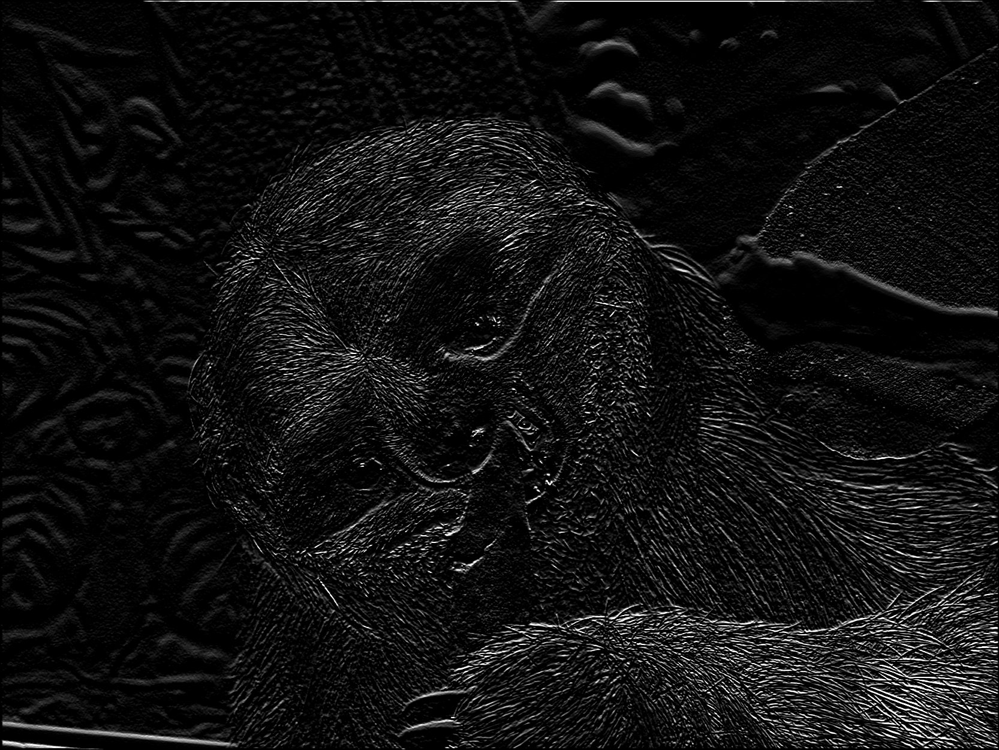

# ProjectSobelFilter

Edge Detection


## Project Description

The project will demonstrate how to use [Sobel filter](https://docs.nvidia.com/cuda/npp/image_filtering_functions.html#image-filter-sobel) that is available at [NVIDIA Performance Primitive (NPP) - Image Processing](https://docs.nvidia.com/cuda/npp/introduction.html) library.


## Code Organization

src/ Directory to hold source code.

bin/ Directory that holds all binary/executable code that is built automatically or manually. Executable code should have use the .exe extension or programming language-specific extension.

data/ Directory to hold all input and output (data or image).

lib/ Any required library to build and run the project.

Makefile Makefile to compile and build the project.

run.sh Script to run the execution code.


## Build and Run

### Linux

```
$ make clean build

$ make run
```


## Results

Log is available at data/output.txt

Input image 


is converted to the output image

